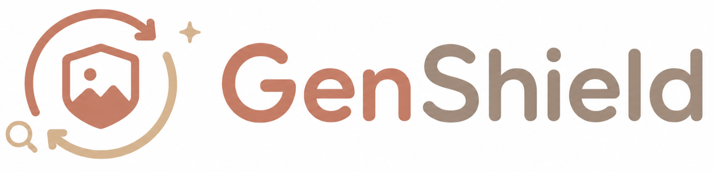
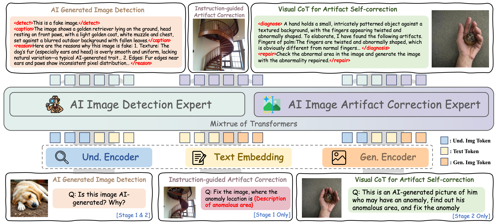
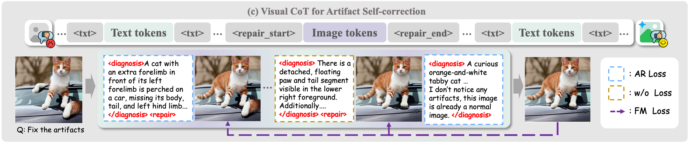
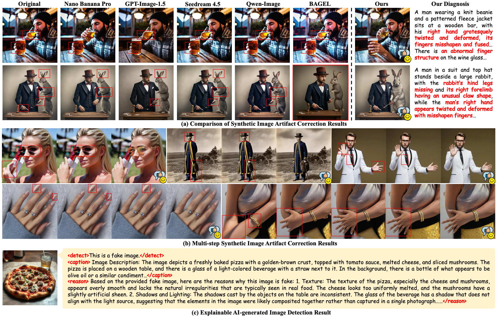

<div align="center">

<h3> GenShield: Unified Detection and Artifact Correction for AI-Generated Images </h3>
<h4> 🔥 ICML 2026 </h4>

Zhipei Xu<sup>1,\*</sup>,
Xuanyu Zhang<sup>1,\*</sup>,
Youmin Xu<sup>2,\*</sup>,
Qing Huang<sup>1</sup>,
Shen Chen<sup>2</sup>,
Taiping Yao<sup>2</sup>,
Shouhong Ding<sup>2</sup>,
Jian Zhang<sup>1</sup>

<sup>1</sup> School of Electronic and Computer Engineering, Peking University &nbsp;&nbsp;
<sup>2</sup> Tencent Youtu Lab


<!-- TODO(user): fill in arXiv ID once available -->
[](https://arxiv.org/pdf/2605.16122)
[](./LICENSE)


</div>


---


<details open><summary>💡 We also have other related projects on AI-generated content forensics that may interest you ✨. </summary><p>

> [**FakeShield: Explainable Image Forgery Detection and Localization via Multi-modal Large Language Models [ICLR 2025]**](https://arxiv.org/abs/2410.02761) <br>
> Zhipei Xu, Xuanyu Zhang, Runyi Li, Zecheng Tang, Qing Huang, Jian Zhang <br>
[](https://github.com/zhipeixu/FakeShield)  [](https://github.com/zhipeixu/FakeShield) [](https://arxiv.org/abs/2410.02761) <br>

> [**AvatarShield: Visual Reinforcement Learning for Human-Centric Video Forgery Detection**](https://arxiv.org/abs/2505.15173) <br>
> Zhipei Xu, Xuanyu Zhang, Xing Zhou, Jian Zhang <br>
[](https://github.com/zhipeixu/AvatarShield)  [](https://github.com/zhipeixu/AvatarShield) [](https://arxiv.org/pdf/2505.15173) <br>

> [**EditGuard: Versatile Image Watermarking for Tamper Localization and Copyright Protection [CVPR 2024]**](https://arxiv.org/abs/2312.08883) <br>
> Xuanyu Zhang, Runyi Li, Jiwen Yu, Youmin Xu, Weiqi Li, Jian Zhang <br>
[](https://github.com/xuanyuzhang21/EditGuard)  [](https://github.com/xuanyuzhang21/EditGuard) [](https://arxiv.org/abs/2312.08883) <br>

> [**OmniGuard: Hybrid Manipulation Localization via Augmented Versatile Deep Image Watermarking [CVPR 2025]**](https://arxiv.org/abs/2412.01615) <br>
> Xuanyu Zhang, Zecheng Tang, Zhipei Xu, Runyi Li, Youmin Xu, Bin Chen, Feng Gao, Jian Zhang <br>
[](https://github.com/xuanyuzhang21/OmniGuard)  [](https://github.com/xuanyuzhang21/OmniGuard) [](https://arxiv.org/abs/2412.01615) <br>

</p></details>


## 📰 News

<!-- TODO(user): fill in actual acceptance / release dates -->
* **[2026.05.01]** 🎉🎉🎉 GenShield has been accepted at **ICML 2026**!
* **[2026.05.15]** 🔥 We released the **GenShield** paper on [arXiv](https://arxiv.org/abs/2605.16122) and open-sourced the training & evaluation code. Welcome to **star** ⭐️ and **watch** 👀 this repository for the latest updates.


##  GenShield Overview

While AIGI detection has progressed substantially, **how to correct detected AI-generated images with visible artifacts and restore a realistic appearance remains largely underexplored**, and few prior works connect the two tasks. Existing pipelines mark artifacts with boxes or masks and rely on a frozen inpainting model, which suffers from unreliable localization, a frozen-generator bottleneck, and seam artifacts.

We propose **GenShield**, a unified autoregressive framework that *jointly* performs **explainable AIGI detection** and **mask-free, end-to-end artifact correction** in a closed loop from diagnosis to restoration. Built on a Mixture-of-Transformers (MoT) backbone, GenShield couples a **Detection Expert** and an **Artifact Correction Expert** through shared self-attention at every layer, so that the two tasks reinforce each other. We further introduce a **Visual Chain-of-Thought (VCoT) curriculum** that progresses from instruction-guided correction to multi-step "diagnose-then-repair" self-correction with an explicit stopping criterion, and construct **GenShield-Set**, comprising precisely aligned "artifact–restored" image pairs (built on SynthScars) and structured detection annotations (built on Holmes-Set).




## 🏆 Contributions

- **Unified Autoregressive Framework.** The first unified autoregressive framework that connects AIGI detection and artifact correction, forming an end-to-end "diagnose → restore" loop via a MoT architecture with shared self-attention.

- **VCoT-based Curriculum Learning.** A Visual Chain-of-Thought curriculum that transitions from instruction-guided correction to multi-step self-correction with an explicit stopping criterion, while keeping detection active throughout training.

- **GenShield-Set Dataset.** A high-quality dataset of precisely aligned "artifact–restored" image pairs and structured detection annotations, tailored for unified AIGI detection and correction.

- **State-of-the-Art Performance.** 98.8% mean accuracy and 99.8% A.P. on the Holmes-Set detection benchmark across 10 generators, with correction quality surpassing advanced closed-source generators.


## 🛠️ Requirements and Installation


```bash
git clone https://github.com/zhipeixu/GenShield.git
cd GenShield
conda create -n genshield python=3.10 -y
conda activate genshield
pip install -r requirements.txt
pip install flash_attn==2.5.8 --no-build-isolation
```


## 🏋️‍♂️ Train

### Base Model Preparation

GenShield is initialized from `BAGEL-7B-MoT`. Download the base weights:

```bash
pip install huggingface_hub
huggingface-cli download --resume-download ByteDance-Seed/BAGEL-7B-MoT --local-dir weight/BAGEL-7B-MoT
```

### Data Preparation

Our training data consists of **GenShield-Set-Detect**, built on top of Holmes-Set, and **GenShield-Set-Correct**, built on top of SynthScars.

1. **`GenShield-Set-Detect`** — download from [Holmes-Set](https://github.com/wyczzy/AIGI-Holmes).
2. **`GenShield-Set-Correct`** — download from our HuggingFace repository (**coming soon**).

After downloading, edit [`data/dataset_info.py`](./data/dataset_info.py) and update each entry's `jsonl_path`, `data_dir`, and `num_total_samples` to match your local dataset layout. The sampling weights and image-transform settings are declared separately in the YAML configs under [`data/configs/`](./data/configs).

> **Before launching training, also replace the placeholder absolute paths (`/path/to/...`) in `scripts/*.sh` with paths on your own machine.**

### Stage 1 — Instruction-Guided Correction + AIGI Detection

Stage 1 jointly trains the Correction Expert with strong supervision from explicit defect descriptions, and the Detection Expert with structured detection annotations. The data mixture and sampling ratios are declared in [`data/configs/stage1.yaml`](./data/configs/stage1.yaml).

```bash
bash scripts/train_stage1.sh
```


### Stage 2 — VCoT Self-Correction + AIGI Detection

Stage 2 keeps detection training unchanged and upgrades correction from external-instruction editing to **multi-step Visual Chain-of-Thought (VCoT) self-correction with an explicit stopping criterion**. The data mixture and ratios are declared in [`data/configs/stage2.yaml`](./data/configs/stage2.yaml).



The pipeline samples four interleaved sub-tasks during training:

| Sub-task | Input | Output | Loss |
|---|---|---|---|
| `correction_stage2_initial`      | anomalous AIGI                       | defect-diagnosis text + repaired image   | CE + MSE |
| `correction_stage2_terminate`    | already-clean image                  | "no anomaly" diagnosis + same image      | CE + MSE |
| `correction_stage2_intermediate` | half-repaired image (Stage-1 output) | continuation text + fully-repaired image | MSE (image only) |
| `aigi_detection`                 | image                                | structured `<detect><caption><reason>`   | CE |

```bash
bash scripts/train_stage2.sh
```


## 🎯 Test

### AIGI Detection

Detect whether an image is AI-generated or real, together with a natural-language explanation.

Edit the paths in `scripts/infer_aigi_detection.sh`, then run:

```bash
bash scripts/infer_aigi_detection.sh
```

The script wraps `inference/infer_aigi_detection.py` and exposes the following knobs:

- `MODEL_PATH`: path to the `BAGEL-7B-MoT` base directory (used for tokenizer / VAE / ViT).
- `CHECKPOINT_PATH`: path to your trained GenShield checkpoint (`ema.safetensors`).
- `IMAGE_FOLDER`: a folder that contains `real/` and/or `fake/` subfolders. The script walks both and writes per-image predictions into a JSONL file under the same folder, which can then be diffed against ground truth to compute accuracy.
- `PROMPT`: the detection question fed to the model (default: *"Please evaluate whether this image is an AI creation or something real, and provide an explanation."*).
- `MAX_IMAGES`, `SEED`: optional caps and random seed.

We follow the evaluation protocol of [Holmes-Set](https://github.com/wyczzy/AIGI-Holmes), which spans 10 generators (Janus, Janus-Pro-1B, Janus-Pro-7B, Show-o, LlamaGen, Infinity, VAR, PixArt-XL, SD3.5-Large, FLUX). Run the script for each generator's subfolder, then aggregate the per-image JSONL outputs to compute per-generator accuracy / A.P.

<!-- TODO(user): we currently produce per-image JSONL but do not ship a per-generator aggregation script. Please tell me whether you want one bundled in the release. -->

### Artifact Correction

We evaluate correction on the **SynthScars** benchmark using both single-step (Stage-1) and iterative VCoT (Stage-2) variants:

```bash
# Stage-1: caption-guided single-step repair
bash scripts/infer_stage1_repair.sh

# Stage-2: "diagnose-then-repair" with auto-generated description
bash scripts/infer_stage2_repair.sh
```

Both scripts expose BAGEL-style sampling knobs (`CFG_TEXT_SCALE`, `CFG_IMG_SCALE`, `NUM_TIMESTEPS`, `TIMESTEP_SHIFT`, ...) and write the restored images plus a `results.json(l)` file to `OUTPUT_DIR` for downstream metric computation.


## 📊 Main Results

### Qualitative Results



<!-- TODO(user): paste the final numbers + Table 1 / Table 2 from the camera-ready PDF that you want to surface in the README. I have intentionally not transcribed numbers beyond the headline figure (98.8% / 99.8%) to avoid OCR errors. -->


## 📜 Citation

If you find GenShield useful for your research, please consider citing:

```bibtex
@inproceedings{xu2026genshield,
    title     = {GenShield: Unified Detection and Artifact Correction for AI-Generated Images},
    author    = {Xu, Zhipei and Zhang, Xuanyu and Xu, Youmin and Huang, Qing and Chen, Shen and Yao, Taiping and Ding, Shouhong and Zhang, Jian},
    booktitle = {Proceedings of the 43rd International Conference on Machine Learning (ICML)},
    year      = {2026}
}
```


## 🙏 Acknowledgement

GenShield is built on top of the excellent open-source efforts of the community. We sincerely thank:

- [**BAGEL**](https://github.com/bytedance-seed/BAGEL) — the Mixture-of-Transformers backbone we adopt and extend.
- [**SynthScars / LEGION**](https://github.com/opendatalab/LEGION) — anomaly annotations used to construct `GenShield-Set-Correct`.
- [**Holmes-Set / AIGI-Holmes**](https://github.com/wyczzy/AIGI-Holmes) — detection annotations used to construct `GenShield-Set-Detect`.

This project is released under the [Apache 2.0 License](./LICENSE), inheriting from the BAGEL upstream license.

